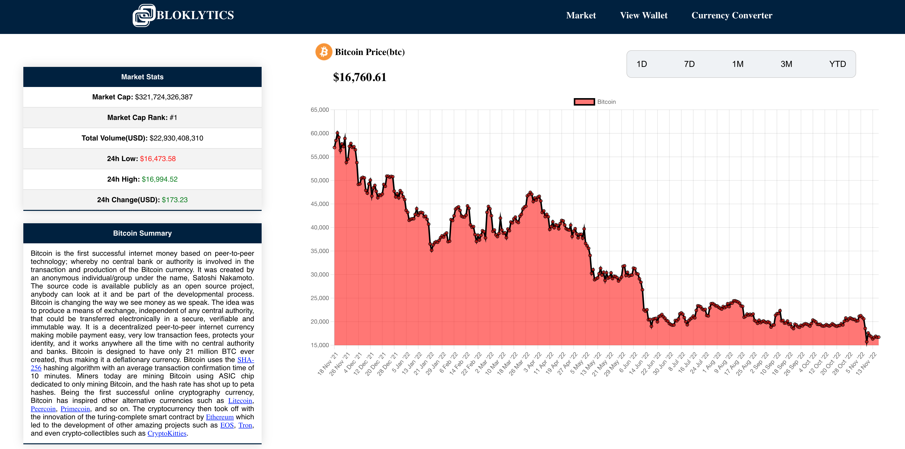

 

  

<h3 align="center">Bloklytics</h3>

  

    Get live cryptoprices and conversions
     
    <a href="http://coffeebets.com target="_blank" rel="noopener noreferrer"/"><strong>Go to Site »</strong></a> 
  

### Images

<a href="#readme-top">back to top</a>

